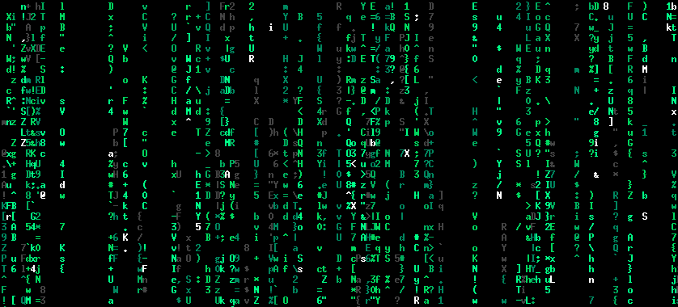

# charrain

This is my personal implementation of a green character rain screen as seen in "The Matrix". For similar projects that are more mature and offer better portability and plenty of options, check [`cmatrix`](https://github.com/abishekvashok/cmatrix), [`tmatrix`](https://github.com/M4444/TMatrix) and [`unimatrix`](https://github.com/will8211/unimatrix). I'm writing `charrain` for fun and practice.

## Objectives

- Use as few resources (memory, CPU) as possible
- Use as few dependencies as possible (no ncurses)
- Get as close to the original as possible, minus Japanese characters
- Assumptions over options, at least for the time being
- Compatibility and portability can be sacrificied

## State

- Only tested on Linux
- Works well in urxvt, but flickers in all other terminals I've testet it in

## Dependencies / Requirements

- Terminal that supports 256 color mode (8 bit colors)
- Requires `TIOCGWINSZ` to be available to query the terminal size

## Building / Running

You can just run the included `build` script. After that, you should be able to run it from the `bin` directory:

    ./build
    ./bin/charrain

## Performance

I've compared CPU and RAM usage against that of `cmatrix`, `tmatrix` and `unimatrix` a little. CPU usage is from `top`, memory via `smem`, looking at PSS. I've ran all three with settings that give somewhat similar visual results, in a full screen terminal (1920x1080 px). Here are the approximate findings:

|           |  CPU  |   RAM | Language | ran as                     |
|-----------|-------|-------|----------|----------------------------|
|  charrain |  ~7 % | 162 K | C        | charrain                   |
|   cmatrix |  ~7 % | 837 K | C        | cmatrix -b -u10            |
|   tmatrix |  ~6 % | 2.5 M | C++      | tmatrix                    |
| unimatrix | ~11 % | 9.4 M | Python   | unimatrix -b -s=90 -l=o -f |

It looks like `tmatrix` is the most efficient regarding CPU time, but also uses the most amount of memory amongst the C/C++ implementations. `cmatrix` and `charrain` seem to perform very similar in the CPU department, but `charrain` only uses about a fourth of the memory. As expected, `unimatrix` uses the most CPU and memory.

Note, however, the shortcomings in features, portability and terminal compatibilty that `charrain` has compared to the other three.

