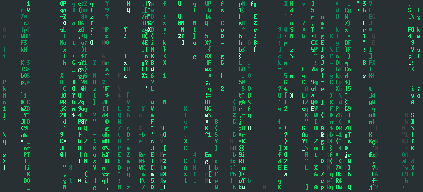

# charrain

This is my personal implementation of a green character rain screen as seen in "The Matrix". There are great implementations out there already, for example `cmatrix`, `unimatrix` and `tmatrix`. They do a pretty good job and the goal of this project is not to compete with them. Rather, this is a recreational project for fun and practice. Here are some artifical rules I've set for it:

- use as few resources (memory, CPU) as possible
- use as few dependencies as possible (no ncurses)
- get as close to the original as possible, minus Japanese characters
- assumptions over options, at least for the time being
- compatibility and portability can be sacrificied

Currently, this works pretty nicely in Linux, using (u)rvxt, but flickers in all other terminals I've testet it in. It assumes a terminal that supports 256 color mode.

